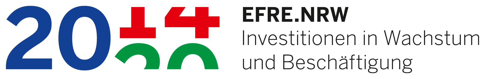

# Service Templates


_(Public mirror: https://github.com/point8/service-templates)_

## Run your own TLS secured data (visualization) service with docker

Running your [streamlit](https://streamlit.io/), [voila](https://voila.readthedocs.io/en/stable/index.html), [dash](https://dash.plotly.com/) or [FastAPI](https://fastapi.tiangolo.com) app as a cloud service with a simple password authentication and secured by HTTPS.

The repository consists of example apps and a reverse proxy to automatically handle the HTTPS endpoint and TLS certificates. Everything is glued together and deployed using [`docker-compose`](https://docs.docker.com/compose/).

## How to start?

Fork the repo and then go through the following parts one by one. Please read through the whole README once before touching anything.

At the moment
- streamlit
- voila
- dash
- FastAPI

templates are included. Feel free to add another one by opening a MR.

### Server and Domain

* Open a [new Issue](https://git.point-8.de/it/tachyon/-/issues/new) and request the `<subdomain>.point8.cloud` you need and 
* if you have any requirements on the computational part (If not, you get a [CPX11](https://www.hetzner.com/de/cloud)).
* Also please specify how long the service will be needed.
* Who else besides you, needs administration access to the server?
* Assign the Issue to Christophe or Vitorio ([Runbook](https://git.point-8.de/it/tachyon/-/blob/main/runbooks/service-templates.md)). Then wait for instructions. 

In the meantime you can continue with the next steps:


### SSH

You will connect to your new server using SSH. You can already add an entry to your `~/.ssh/config`:

```
Host your_subdomain.point8.cloud
    Hostname your_subdomain.point8.cloud
    User your_username
    Port 22122
    IdentityFile ~/.ssh/your_point8_ssh_key
    ForwardX11 yes
    ForwardAgent yes
```

### Python

Python is handeled by [`pyenv`](). The version is fixed in the `.python-version` file by calling `pyenv local X.Y.Z`.

### Service

There are different service templates available. See below.

After you decided what kind of service you want to use, you have to adapt your file in two places:

1. Remove all unused services from the `docker-compose.yml` and also remove the dependencies (`depends_on:`) under the `caddy:` service config.
2. Pick the correct `reverse_proxy` in the `Caddyfile`

Make sure to update your dependencies and keep the `pyproject.toml` and the `poetry.lock` files up to date. Also make sure, that the Python version dependency is the same as set in `.python-version`.

#### Streamlit

Everything is located in the `streamlit/` directory. Feel free to add your own code. A basic app can be found in `streamlit/app.py`.

If you somehow need to change the command the streamlit app is run, you need to adapt the last line in the `Dockerfile` to reflect those changes:

```
CMD ["poetry", "run", "streamlit", "run", "app.py"]
```

#### Voilà

Everything is located in the `voila/` directory. Feel free to add your own code. A basic app can be found in `voila/example.ipynb`.

If you somehow need to change the command the voila app is run, you need to adapt the last line in the `Dockerfile` to reflect those changes:

```
CMD ["poetry", "run", "voila", "--no-browser", "--Voila.ip='0.0.0.0'", "--port=8866", "example.ipynb"]
```

If you remove the last part (`"example.ipynb"`), the user gets a list of all available notebooks.

### Dash

Everything is located in the `dash/` directory. Feel free to add your own code. A basic app can be found in `dash/example.py`.

If you somehow need to change the command the dash app is run, you need to adapt the last line in the `Dockerfile` to reflect those changes:

```
CMD ["poetry", "run", "gunicorn", "example:server", "-b", ":8050"]
```

### FastAPI

Everything is located in the `fastapi/` directory. Feel free to add your own code. A basic app can be found in `fastapi/example.py`.

If you somehow need to change the command the FastAPI app is run, you need to adapt the last line in the `Dockerfile` to reflect those changes:

```
CMD ["poetry", "run", "uvicorn", "example:app", "--host", "0.0.0.0", "--port", "8080"]
```

To visit the API documentation append `/docs` to the URL., e.g. [https://localhost/docs](https://localhost/docs).

### Reverse Proxy and TLS

[Caddy](https://caddyserver.com/) is used to act as a reverse proxy, handle TLS certificates, and forward the user from the standard HTTP(s) ports to your hidden service in the background.

Everything is configured in the `Caddyfile`.

* If you want to test everything locally, you can leave the `Caddyfile` as is, if you deploy it to a server you need to
* change the domain name in line 4 from `localhost` to `your_subdomain.point8.cloud`.

As long as you test it locally you have to accept/override your browser warnings caused by an "insecure" TLS connection due to an untrusted self-signed certificate.

#### Change basic authentication

The authentication to the service is done using HTTP basic auth.

The default credentials are `guest:geheim`

The following section in the `Caddyfile` is responsible for setting it.

```
basicauth {
    guest JDJhJDE0JEhDc0lEcGRraS94SFZ1TzlEUjl5Wi5WM3hOa0xWSlVQYzBOS0xJMmwzczN4Qk9zbnlUU29p
}
```

To create a new password use e.g.

```
docker run -it caddy:latest caddy hash-password --plaintext "1-super-secret-pa$$word"
```

If you omit the `--plaintext` option, you can type in the password interactively.

Feel free to adapt the set credentials to your needs. Remember to update the username and password hash in the `Caddyfile` after you generated new credentials.

### Development

You can develop everything local

* Create the internal and external docker networks
    ```
    docker network create web
    docker network create --internal local
    ```
* Spin everything up using (in the repository root, not inside the service template directory!)
    ```
    docker-compose up --build
    ```
* If you make changes repeat the last step.
* Visit your page under [https://localhost](https://localhost) (You have override the browser warnings, see "Reverse Proxy and TLS").

### Deployment

In order to deploy your service, you need to login into your server using SSH.

* Clone your repository
* Create the internal and external docker networks
    ```
    docker network create web
    docker network create --internal local
    ```
* Spin everything up using
    ```
    docker-compose up --build
    ```
* If you make changes, update the repository on the server and repeat the last step.
* Use `docker-compose start/stop` to start and stop your service and `docker-compose down` to stop it and remove all containers
* If you are satisfied, you can run everything as a daemon with
    ```
    docker-compose up --detach
    ```
* Visit your page under the designated URL

## Launch multiple applications at subdomains
It is possible to launch multiple apps and make them accessible at a self defined path. For better readability example names beginning with `my_` are used. These can be replaced by custom names.
1. Duplicate the service directory (streamlit/, fastapi/, ...) and rename it to `my_new_service_directiory`. Add the content of your additional application as described in the service section above.
2. Inside `docker-compose.yml` create another service:
    - Duplicate the section of the chosen service and rename it e.g. `streamlit` -> `my_new_service`.
    - Change the line `context: ./XXX` to the directory created in step 1 (`context: ./my_new_service_directiory`).
3. Add the following lines to the `Caddyfile` after the `reverse_proxy` statement:
    ```
    handle_path /your_custom_path/* {
        reverse_proxy my_new_service:XXXX 
    }
    ```
4. Deploy the service as described above. The new service is now reachable under `your_subdomain.point8.cloud/your_custom_path` as definde in the `Caddyfile`.

Currently this setup is only tested with streamlit applications, but should work with the other services too.


## Smart Erosion

Point 8 is a partner in the research project SmartErosion. This tool was created as part of the research project. The project is supported by funds from the __European Regional Development Fund (ERDF) 2014-2020 "Investment for Growth and Jobs"__. 

<p float="left">
  
  
</p>
